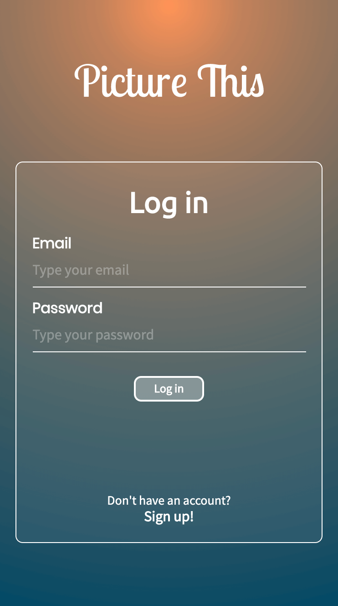
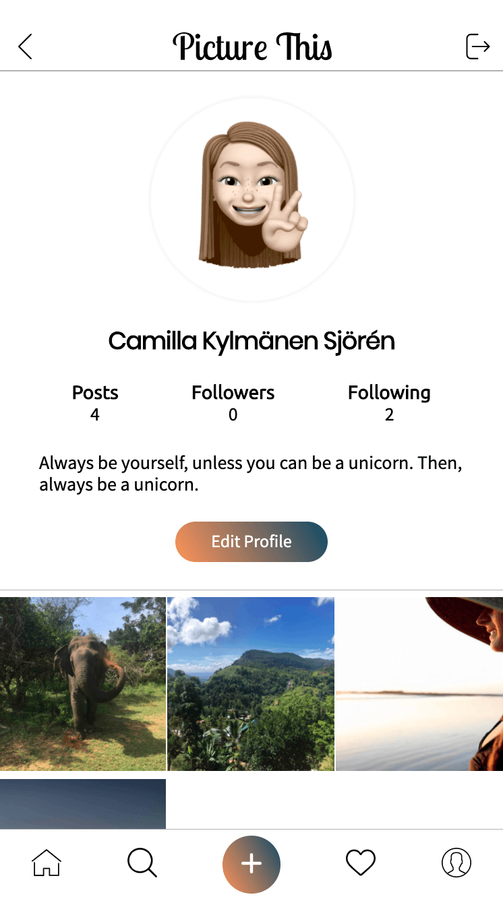
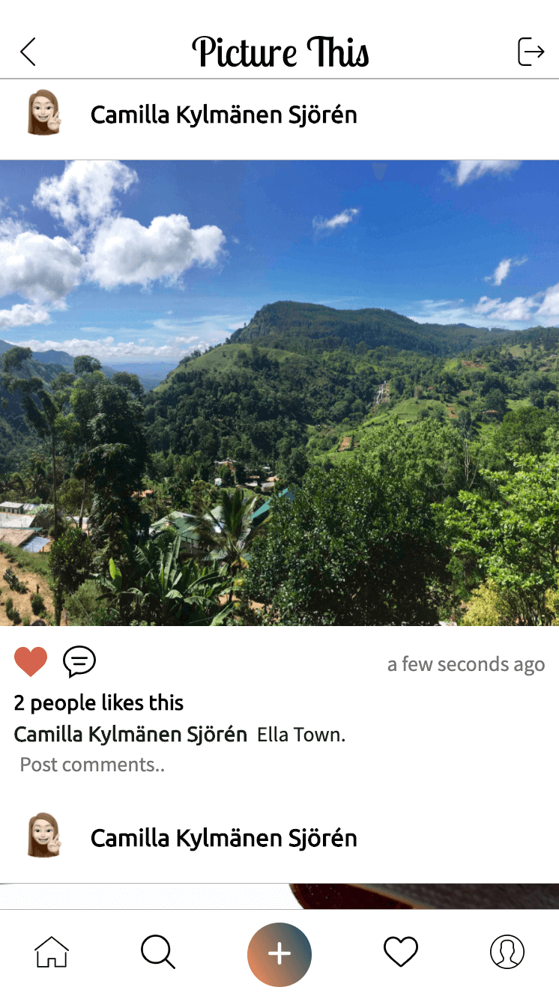

# Picture This :selfie:


## Description

School assignment at Yrgo Webbutvecklare where we are creating an Instagram clone. 

## Built with

* SQL
* PHP
* HTML
* CSS
* JavaScript

The application is responsive and is built using the method mobile-first.

## Required features

- [x] As a user I should be able to create an account.
- [x] As a user I should be able to login.
- [x] As a user I should be able to logout.
- [x] As a user I should be able to edit my account email, password and biography.
- [x] As a user I should be able to upload a profile avatar image.
- [x] As a user I should be able to create new posts with image and description.
- [x] As a user I should be able to edit my posts.
- [x] As a user I should be able to delete my posts.
- [x] As a user I should be able to like posts.
- [x] As a user I should be able to remove likes from posts.

## Extra features

- [x] As a user I am be able to follow/unfollow users.
- [x] As a user I am be able to see other users posts.
- [x] As a user I am able to delete my account and all information related to it.

## Preview
 
 
 
 

## Installation
 1. Clone down the project to your computer

    ```
    $ git clone https://github.com/camiwd/picture-this.git
     ```
2. Start your server
3. Open the index.php file in your browser

## Tested by

* [Dominic Kersch](https://github.com/AltDom)
* [Emelie Petersson](https://github.com/emeliepetersson)

## Code review

Michaela Lundborg

* functions.php:258 - you didn’t declare the type of the parameter $postDate.
* functions.php:261 - in this function you declare the return type using both “: string” and “@return string”, in the rest of your functions you’re only using @return - be consistent.
* register.php - a lot of comments which makes it a bit hard to read the code, remove the comments you don’t need (the diedumps for example).
* login.php, edit-avatar.php - same as above, a lot of diedumps
* edit-avatar.php:26 - in the array containing allowed filetypes you have jpeg and png, but the text underneath says only jpg and png are allowed. Maybe you should allow all three. (also check your other files containing this code)
* edit-avatar.php:33 - perhaps you could add how big the filesize limit is in the text, makes it easier for the user to pick an allowed image. (also check your other files containing this code)
* You have two different folders called uploads, one is empty - do you need both?
* If I register a new user and doesn’t want to upload an avatar image, the placeholder works fine on the profilepage. But when I add a post the placeholder doesn’t show up as avatar in the feed.
* Perhaps you could put your navigation in a nav element.
* The app looks really nice, great work! :) 

## License

This project is licensed under the MIT License - see the LICENSE file for details.

## Authors

Camilla Kylmänen Sjörén
